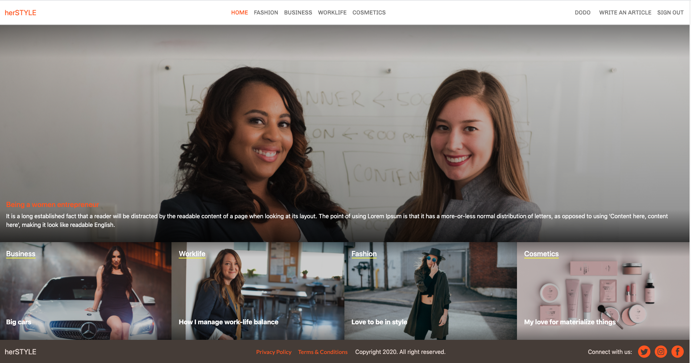
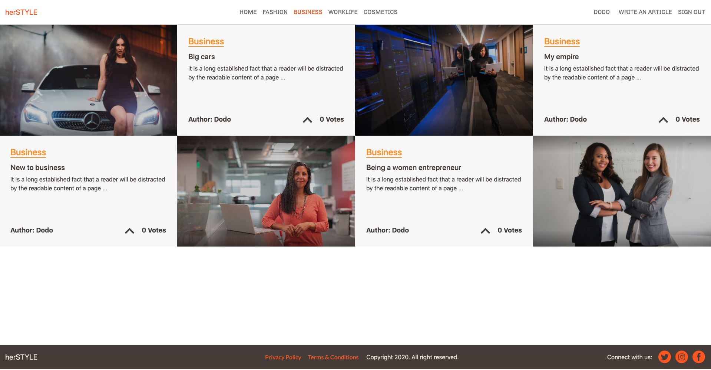
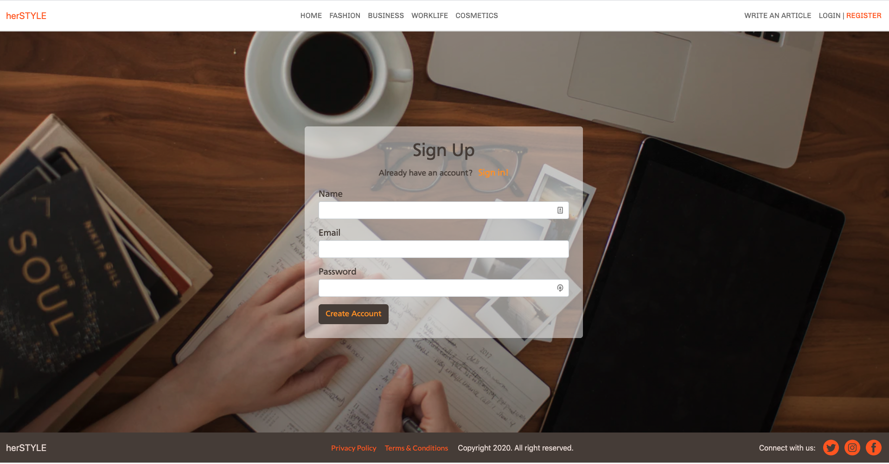
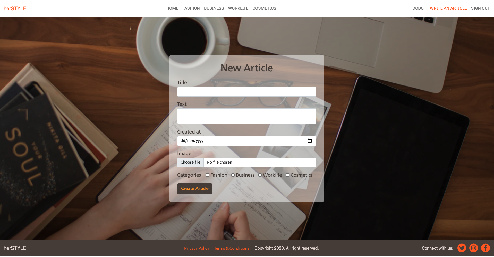

# herSTYLE ROR Capstone project

> This project is for Ruby on Rails capstone, which is based on lifestyle articles website. I have follow the given design of the website, but I have chossen the article website for women lifestyle. I am planning to work on it in future to add more features and I'll add a personal logo as well forthis web site.






## Built With

- Ruby v2.7.2
- Ruby on Rails v5.2.4
- Rspec
- Capybara
- rubocop
- heroku

## Live Demo

[TBD](https://herokuapp.com/)

## Getting Started

To get a local copy up and running follow these simple example steps.İnitial

### Prerequisites

Ruby: 2.7.2
Rails: 5.2.3
Postgres: >=9.5

**Setup**

- Clone this repository with `git@github.com:Amita-Roy/ROR-Capstone-Her_Style.git` using your terminal or command line.<br>
- Change to the project directory by entering `cd her_style` in the terminal<br>
- Next run `bundle install` to install the necessary dependencies<br>
- run rails `active_storage:install`
- run `rails db:create`
- Run `rails db:migrate` to setup your local database.<br>
- Finally run `rails console` to start the application.<br>

### Usage

Start server with:

```
    rails server
```

Open `http://localhost:3000/` in your browser.

### Run tests

> for test formatting add below script in .rspec file

```
    rpsec --format documentation
```

> To run all the tests run below script in the terminal

`rspec`

## Author

👤 **Amita Roy**

- Github: [@Amita](https://github.com/Amita-Roy)
- Twitter: [@Amita](https://twitter.com/AmitaRoy14)
- Linkedin: [@Amita](https://www.linkedin.com/in/amita-roy-3b823b68/)

## 🤝 Contributing

Contributions, issues and feature requests are welcome!

Feel free to check the [issues page](issues/).

## Show your support

Give a ⭐️ if you like this project!

## Acknowledgments

> [https://www.behance.net/gallery/14554909/liFEsTlye-Mobile-version](https://www.behance.net/gallery/14554909/liFEsTlye-Mobile-version)
> Design idea by [Nelson Sakwa on Behance](https://www.behance.net/sakwadesignstudio)

> The design utilizes three free fonts. Use the links provided to download them :
> Lato font - http://www.fontsquirrel.com/fonts/lato
> Cartogothic standard - http://www.fontex.org/download/Carto-gothic-std.otf
> Chivo - http://www.fontsquirrel.com/fonts/chivo
> Social media icons by Picons.me - http://picons.me/

- Stock images from unsplash

  - <span>Photo by <a href="https://unsplash.com/@linkedinsalesnavigator?utm_source=unsplash&amp;utm_medium=referral&amp;utm_content=creditCopyText">LinkedIn Sales Navigator</a> on <a href="https://unsplash.com/s/photos/women-business?utm_source=unsplash&amp;utm_medium=referral&amp;utm_content=creditCopyText">Unsplash</a></span>

  - <span>Photo by <a href="https://unsplash.com/@linkedinsalesnavigator?utm_source=unsplash&amp;utm_medium=referral&amp;utm_content=creditCopyText">LinkedIn Sales Navigator</a> on <a href="https://unsplash.com/s/photos/women-business?utm_source=unsplash&amp;utm_medium=referral&amp;utm_content=creditCopyText">Unsplash</a></span>

  - <span>Photo by <a href="https://unsplash.com/@wocintechchat?utm_source=unsplash&amp;utm_medium=referral&amp;utm_content=creditCopyText">Christina @ wocintechchat.com</a> on <a href="https://unsplash.com/s/photos/women-business?utm_source=unsplash&amp;utm_medium=referral&amp;utm_content=creditCopyText">Unsplash</a></span>

## 📝 License

TBA
